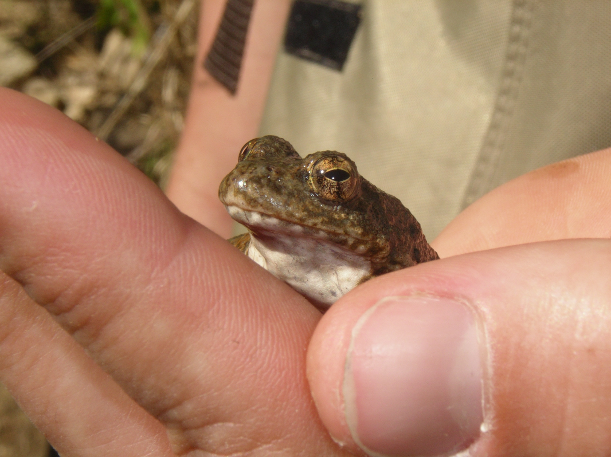
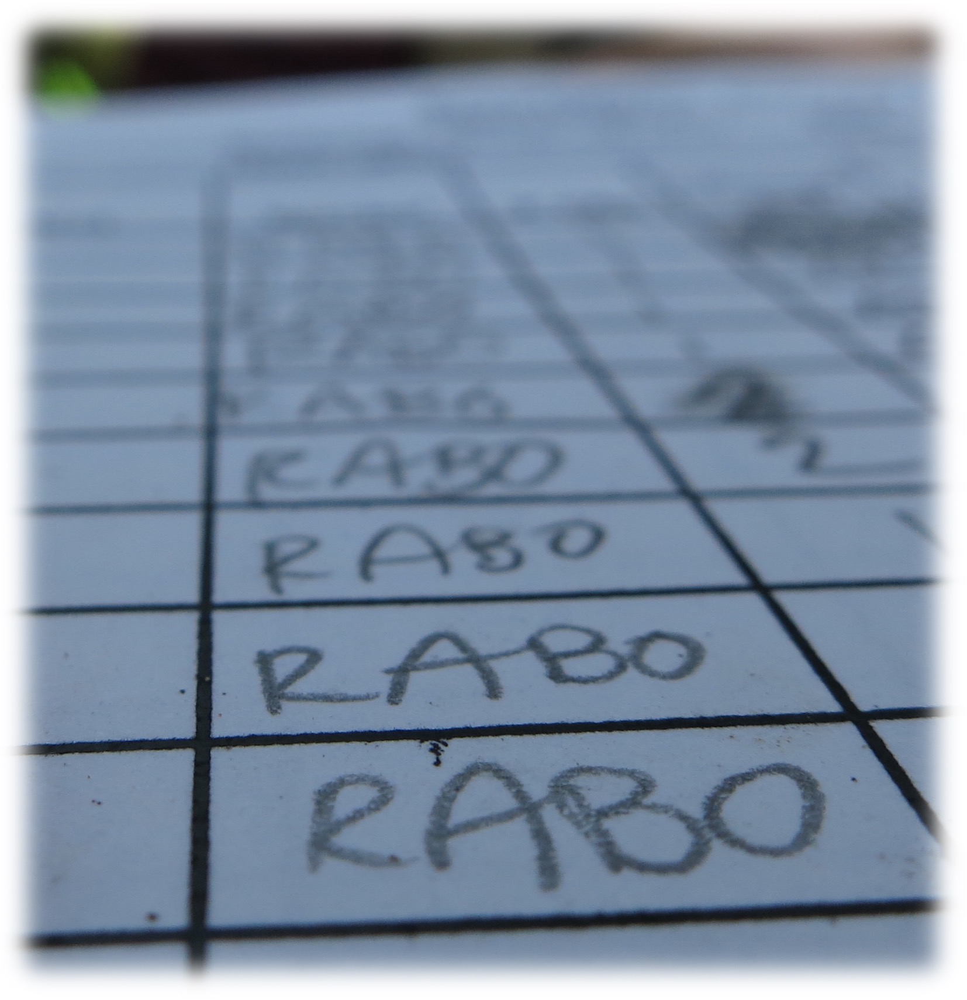
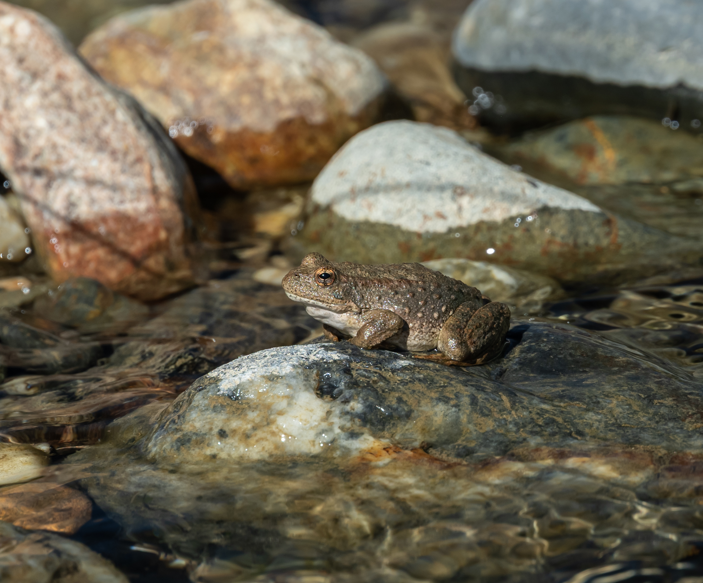
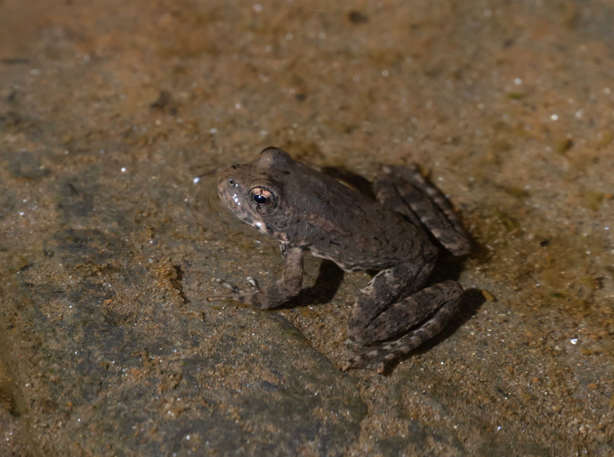

A workshop covering the natural and unnatural history of a once-abundant species, *Rana boylii*.
Workshop materials cover the [**life history**]{.dark-green}, [**habitat use**]{.orange}, and [**ecology**]{.dark-red} of the species, as well provide conservation status.

Survey methodology and field techniques for monitoring the species are also be covered. This workshop provides an understanding of how water management, population decline, and landscape change have impacted the species, and what it will mean for biologists monitoring the species.
\

Content developed and taught by Ryan Peek, Sarah Kupferberg, Alan Striegle, Marcia Grefsrud, Laura Patterson, and Isaac Chellman for the [Elkhorn Slough Coastal Training Program Series](http://www.elkhornsloughctp.org/training/show_train_detail.php?TRAIN_ID=Ec66CMJ), website developed and maintained by R. Peek.

{fig-align="center" height=400}

::: {layout-ncol=4}

{fig-alt="a rana boylii frog sitting in bare hand" fig-align="left" width=400}

{fig-alt="a datasheet close up showing a grid with row after row of 'RABO' in pencil" fig-align="right" width=400}

{fig-alt="A gravid female FYLF at Steephollow Creek" fig-align="right" width=400}

{fig-alt="a rana boylii juvenile frog sitting in water" fig-align="right" width=400}
:::

------------------------------------------------------------------------

These materials may be re-used according to the [CC-BY License](./LICENSE.md).
