::: {.my-title}
# [Applying Conservation]{.orange}

::: {.my-grey}
[Elkhorn Slough RTEP | 2026-05-01]{} 
:::

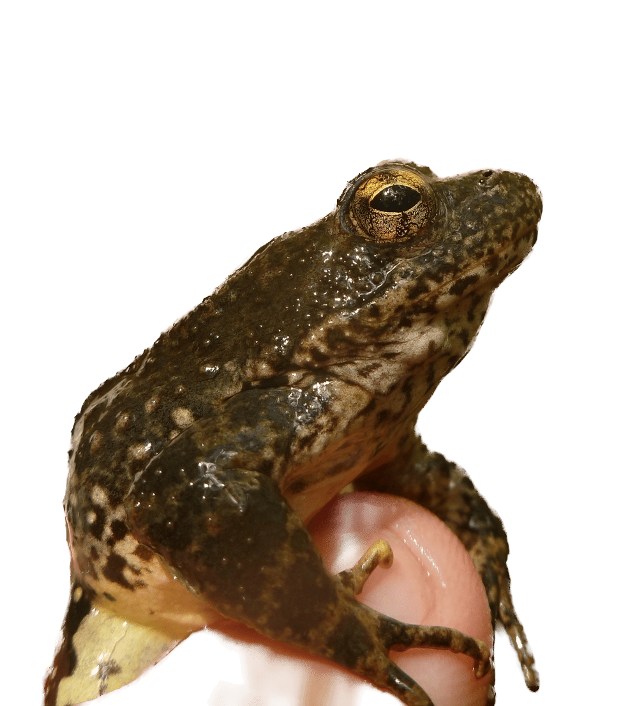{.absolute bottom=0 right=0}
:::

<!-- Overview -->

# {data-menu-title="Wangari Maathai quote"}

::: {.columns .pv4}
::: {.column width="30%"}
::: {.tc}
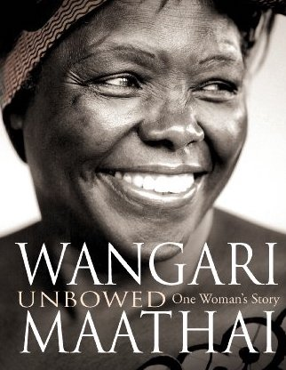
:::
:::

::: {.column width="70%"}

 > “Education, if it means anything, should not take people away from the land, but instill in them even more respect for it, because educated people are in a position to understand what is being lost. The future of the planet concerns all of us, and all of us should do what we can to protect it. As I told the foresters, and the women, [*you don't need a diploma to plant a tree.*]{.navy}”
 
[*Wangari Maathai | Unbowed (2008)*]{.gray}

:::
:::

::: notes
Wangari Maathai, Kenyan peace activist and environmentalist, who in 2004 became the first African woman to win the Nobel Peace Prize. 
:::

## Conservation Strategies

 - Headstarting / Augmentation /Translocation
 - Removal of dams / Flow Management in RABO habitat
 - Watershed protection
 - Invasive Species Management
 - Watershed Scale Management
 - Population and Habitat Monitoring
 - Gene Flow & connectivity

## {.smaller data-menu-title="Dam removal" background-image=../img/sk_image_c001.jpg background-size="contain" background-position="top" background-color="#FFFFFF"}

::: footer
[Dam Removal]{.f2 .black}
:::

## {.smaller data-menu-title="Dam removal: 2" background-image=../img/sk_image_c002.jpg background-size="contain" background-position="top" background-color="#000000"}

::: footer
[Dam Removal]{.white}
:::

## After dam removal  sediment grain  size was much   smaller {.tl .smaller data-menu-title="Dam removal: 3" background-image=../img/sk_image_c003.jpg background-size="contain" background-position="right" background-color="#FFFFFF"}

::: {.columns .pv4}
::: {.column width="35%"}

     

 - Pacific Lamprey to the rescue!
 
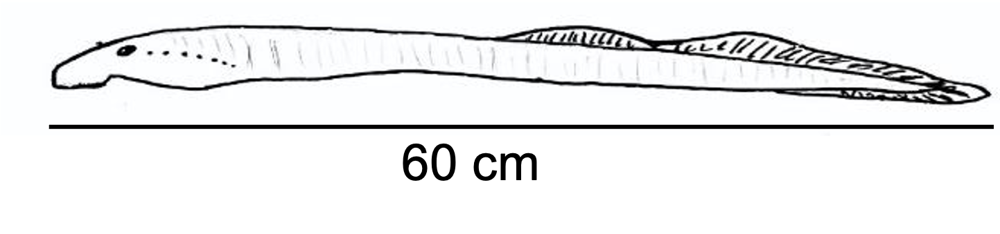{fig-align="center"}
:::
:::

## Excavation and Bioturbation

 

## Breeding shifted upstream...but {.tl .smaller}

::: {.columns .pv4}
::: {.column width="40%"}

[also observed 81 clutches [**in lamprey redds**]{.orange}]{.fragment}

[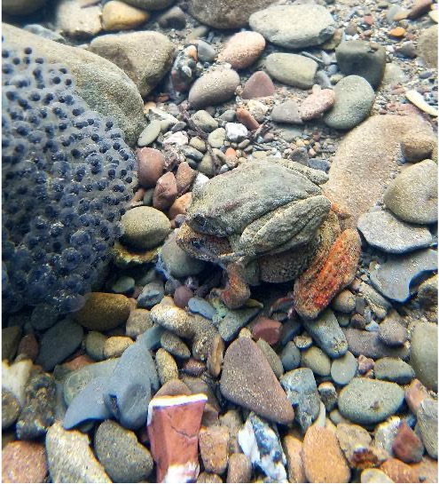]{.fragment}
:::
::: {.column width="60%"}

::: {.fragment}
Eggmasses in redds benefit from:

 - ⬇︎ depth without exposure to ⬆︎ velocity
 - ⬇ mortality due to stranding

 
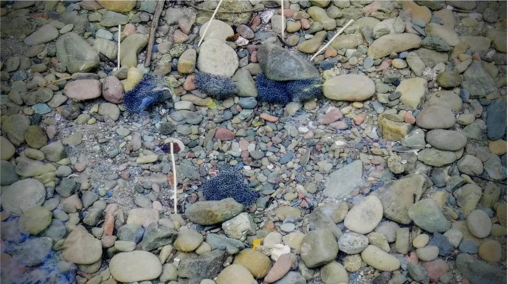
:::
:::
:::

# {data-menu-title="Jim Lichatowitch quote"}

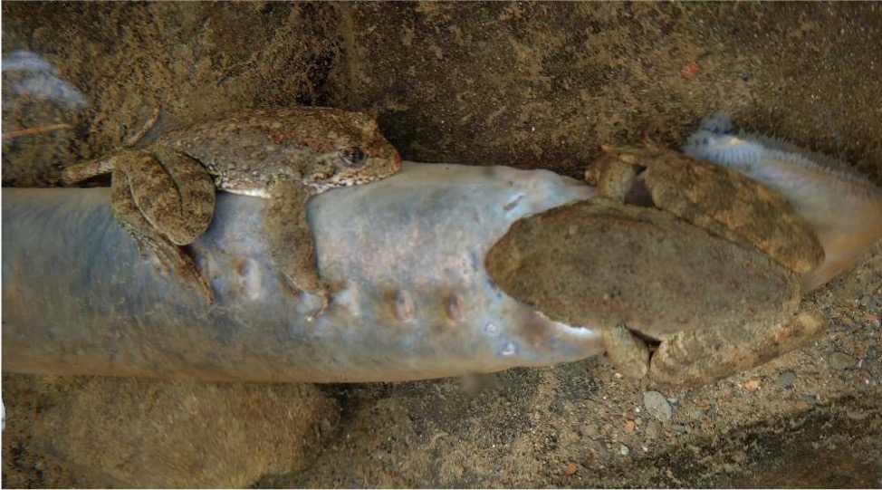{fig-align="center"}

 > [“Animals don’t go extinct because someone shoots the last one, or a bulldozer scrapes away the last habitat. They go extinct because the web of relationships that sustain them unravels...”]{.black}
 
[*Jim Lichatowitch | (2013)*]{.gray}

## Dam Removal {.smaller background-color="#FFFFFF"}

[Population increased when dam was no longer operated.  
Deconstruction did not have a long-lasting impact.]{.f2}

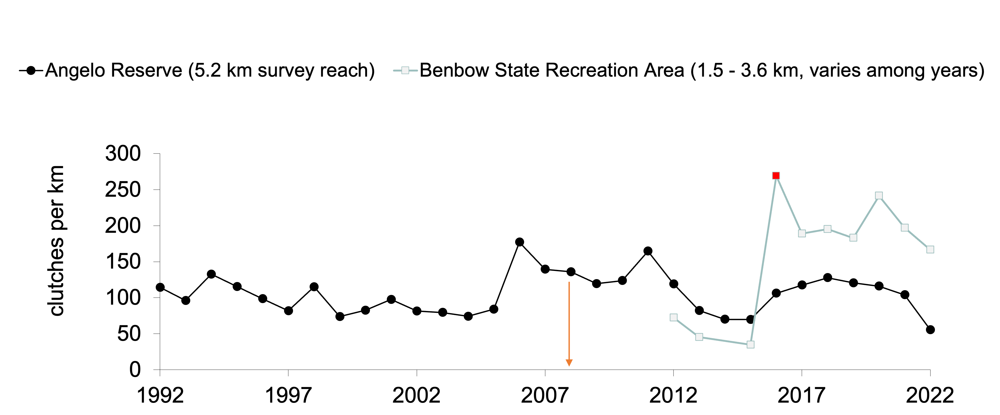

::: footer
Dam Removal
:::

# And...

## Monitoring &nbsp; Results {background-image=../img/sk_benbow00.png background-size="contain" background-position="right" background-color="#CDECFF"}

## Control vs. Impact {style="text-align:left"}

::: {.columns .pv4}

::: {.column width="32%"}
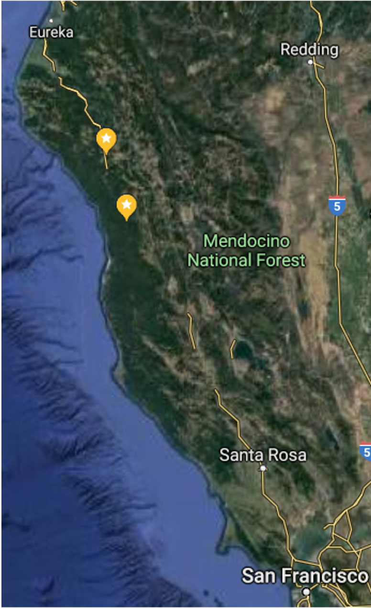
:::
::: {.column width="4%"}

:::
::: {.column width="54%"}

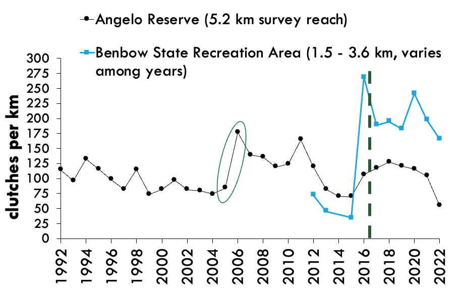{.absolute right=-30 bottom=55 width="72%"}
:::
:::

## {data-menu-title="Control vs Impact" background-image=../img/sk_benbow02.png background-size="contain" background-position="middle"}

## {data-menu-title="R on R" background-image=../img/sk_benbow03.jpg background-size="contain" background-position="bottom"}

::: r-fit-text

[*Did dam removal truly benefit the population when the biggest increase occurred prior to demolition?*]{.f1}
:::

## Alternative hypothesis:{.smaller}

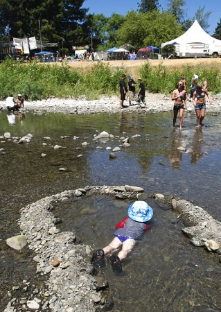{.absolute left=-40 bottom=0 width="33%"}

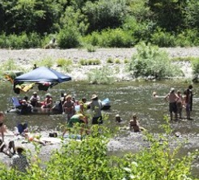{.absolute left=340 bottom=0 width="33%"}

Intense recreation impairs survival of tadpoles, metamorphs

Release from stressor detectable with 3-yr lag

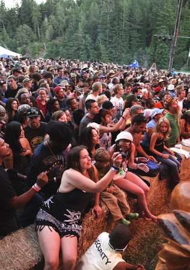{.absolute right=-40 bottom=0 width="35%"}

## {data-menu-title="alt hyp" background-image=../img/sk_benbow05.png background-size="contain" background-position="center" background-color="#CDECFF"}

## Augment threatened populations {.smaller}

::: {.columns .pv4}
::: {.column width="45%"}

 - Cresta Reach of NF Feather
 - PG&E license boating releases
 - Surveyed by Garcia and Associates (2002-2021)
 - Historically, > 30 egg masses / yr
 - [**Only 4 in 2016, 2 in 2017**]{.b .orange}
 - Management changed, population not recovering
 - Introduced predators (bass, crayfish)
:::

::: {.column width="55%"}
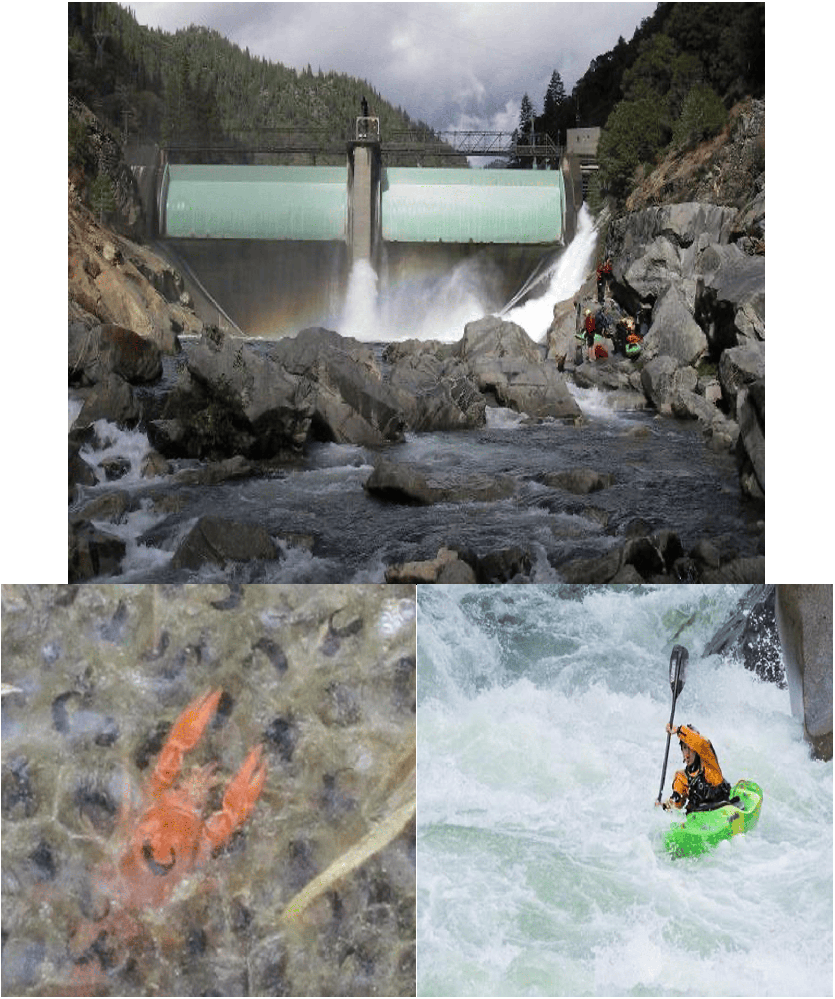{width="80%" fig-align="right"}
:::
:::

::: footer
Augmentation
:::

## Head starting of tadpoles {.smaller}

::: {.columns .pv4}
::: {.column width="50%"}

 - pilot project 2017, expanded 2018-2020
 - rescue eggs from stranding & restore gene flow by sourcing eggs from a different reach
 - w/o intervention, 1 - 4% survival to metamorphosis

:::
::: {.column width="50%"}

 - [With]{.purple} baskets 13.6% of cohort released as metamorphs
 - large size because food supplementation, warm temp

:::
:::
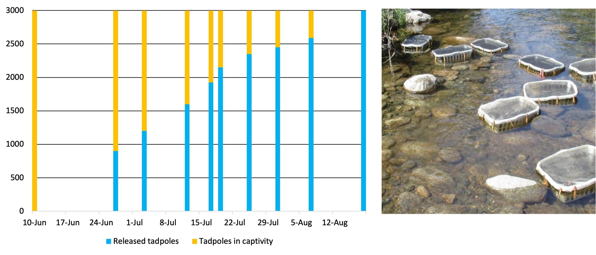{.tc fig-align="center"}

## {.smaller data-menu-title="Zoo headstarting" background-image=../img/sk_image_c06.jpg background-size="contain" background-position="top" background-color="#FFFFFF"}

::: {.columns .pv5}
::: {.column width="70%"}

     
   
  

Zoo-Rearing

- Salvaged egg masses that might strand
- Raised to juvenile and adult stages in tanks and recirculating troughs
- Unintended breeding in tanks

:::
:::

::: footer
Augmentation
:::

## {data-menu-title="Zoo headstarting Results" background-image=../img/sk_image_c07.jpg background-size="cover" background-position="top" background-color="#FFFFFF"}

## {.smaller data-menu-title="Headstarting" background-image=../img/sk_rabo_headstarting_Slide_thru_2026.png background-size="contain" background-position="top" background-color="#000000"}

## Questions? {background-color="#111111" background-image="../img/artsy_datasheet_rabo.jpg" background-size="cover" background-position="bottom"}
